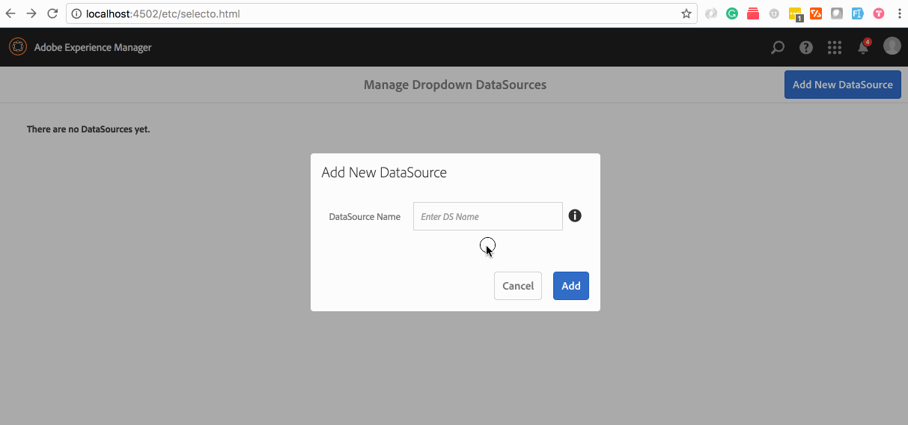

# AEM Selecto
> ### IMPORTANT: This was developed and tested on AEM 6.3

This a content package project generated using the AEM Multimodule Lazybones template.
You can download this package from github's release page, or clone and build from source.  

## Building

This project uses Maven for building. Common commands:

From the root directory, run ``mvn -PautoInstallPackage clean install`` to build the bundle and content package and install to a CQ instance.

From the bundle directory, run ``mvn -PautoInstallBundle clean install`` to build *just* the bundle and install to a CQ instance.

## Why I built this

Because I can! but seriously, as an AEM developer, you have probably needed to create dropdowns for Touch UI dialogs. Often times, the options for these dropdowns change, and so you have to manually change the options. Enter selecto, an AEM Admin UI for developers/authors to author options for Touch UI dialog dropdowns.

> please note that I know of the existing solutions via JSP or Sling Servlet to generate the options, those solotions are more appropriate when the options are not "authorable" i.e. come from a service, list of pages/component ...etc.

### lets walk through an example:
Let's say you want to add a dropdown of countries to a component's Touch UI dialog:

#### The typical boring way:

you'd add the following to your dialog xml:

```xml
<country jcr:primaryType="nt:unstructured" 
         fieldLabel="country"
         name="./country"
         sling:resourceType="granite/ui/components/coral/foundation/form/select">
    <items jcr:primaryType="nt:unstructured">
        <usa jcr:primaryType="nt:unstructured" text="USA" value="United States"/>
        <mx jcr:primaryType="nt:unstructured" text="MX" value="Mexico"/>
    </items>
</country>
```
result:


and this works fine, but if you want to change it later, you have to change the component dialog xml and redeploy.

#### The selecto way:

let's create a new selecto datasource and add countries to it:
> you can access selecto by visiting: `http://localhost:4502/etc/selecto.html` or from AEM touch admin UI: `tools > sites > selecto`



> selecto shows you the `sling:resourceSuperType` to use, in our example it is: `/content/selecto/countries/options`

Now in your component's dialog, the xml for the select changes to:

```xml
<country jcr:primaryType="nt:unstructured" 
         fieldLabel="country"
         name="./country"
         sling:resourceType="granite/ui/components/coral/foundation/form/select">
    <items jcr:primaryType="nt:unstructured"
           sling:resourceSuperType="/content/selecto/countries/options"/>
</country>
```
result:


Now if you go back to selecto page and add/remove/reorder options, they will be reflected on the component dropdown! no deployment neccessary.


